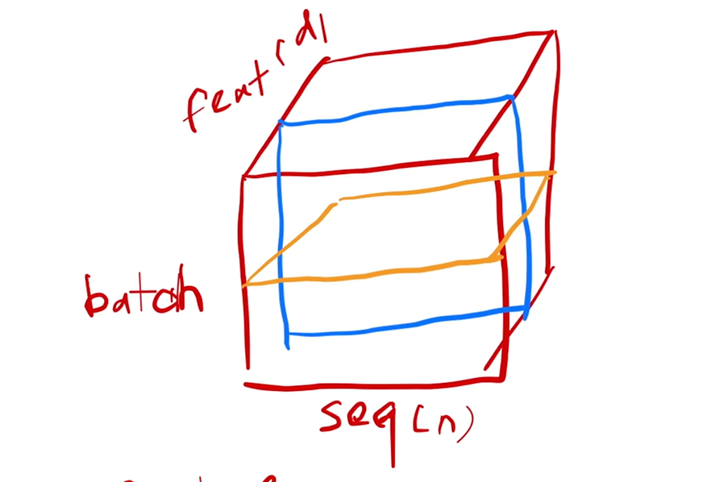
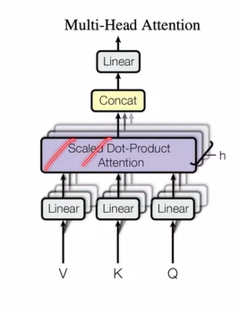
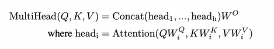
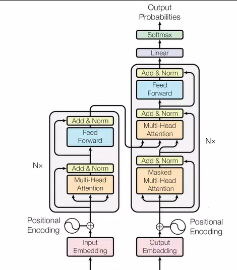

# Abstract
* 序列转录模型(sequence transduction models)：给一个序列，生成另外一个序列。e.g.机器翻译，给一段英文序列，得到一段中文序列。
* 大多数序列转录模型通常基于复杂的CNN和RNN。其中包含了编码器和解码器。
* Transfomer为这篇文章提出的一个simple的架构。模型仅仅依赖于注意力机制(attention mechanisms)，没有使用recurrence以及convolutions(卷积)
* 论文使用了机器翻译的任务来测试Transfomer
* BLEU score：机器翻译中经常使用的衡量标准
  
# Conclusion
* 机器翻译上，Transfomer训练起来比其他模型更快
* 希望能够把Transfomer模型应用到其他任务上，例如images，audio，video。并使得输出less sequential。

# Introction
## Paragraph 1
* 常见的时序模型有long short-term memory(LSTM),gated recurrent neural networks(GRU)
  
## Paragraph 2
* RNN存在的问题：时间上无法并行，输出第99个词，需要先输出前面98个词

## Paragraph 3
* attention在RNN上的作用

## Paragraph 4
* 提出Transformer

# Background
* 卷积：缺点是如果两个像素相隔较远，需要使用非常多的层才能结合；优点是有多个输出通道。attention可以解决前一个问题，而针对后者，提出了Muti-Head Attention
* 提到了self-attention，memory networks

# Model Architecture
## Paragraph1简单阐述encoder以及decoder
* 编码器：输入是长为n的序列(x1,x1,...,xn)，输出是长为n的序列(z1,z1,...,zn)。
* 解码器：输入是长为n的序列(z1,z1,...,zn)，输出是长为m的序列(y1,y1,...,yn)。
* 解码器是自回归的(Auto-regressive),自回归指的是前面的输出会作为后面的输入影响后面的输出

## 3.1 Encoder and Decoder
### Encoder
* 论文中的编码器由下图中的6个完全相同的layer组成(插画)
* 每个layer由两个sub-layer组成，第一个叫multi-head self-attention mechanism(后续会详细解释)；第二个是 a simple, positionwise fully connected feed-forward network。第二个就是一个MLP(后面解释)
* 每个sub-layer都有残差连接(residual connection),然后使用layer normalization。整体公式如下

$$
LayerNorm(x+Sublayer(x))
$$
* 为简单起见，embedding layer和所有的sub-layer输出维度都是512。

### LayerNorm
#### batchNorm
* 考虑二维输入，列是feature；batchNorm是在每个mini-batch里面将每一列变成方差为1，均值为0(具体做法是每个值减去均值除以方差)
#### LayerNorm
* 与batchNorm不一样，LayerNorm是将一行的方差变为1，均值变为0.
#### 三维情况
* 如下图所示

* d是512
* batchNorm是对蓝色部分做均值变0，方差变1处理(针对每个feature)
* LayerNorm是对黄色部分做均值变0，方差变1处理(针对每个样本)
#### 不同的切割方法有什么不同
* **样本序列长度可能不一样**
* 下图是使用batchNorm进行一次切割的示意图

* 下图是使用LayerNomr进行四次切割的示意图

### Decoder

* 相比encoder加入了第三个sub-layer
* 有掩码机制

## 3.2Attention
### 3.2.1 Scaled Dot-Product Attention
* Query向量与Key向量是等长的。均为dk
$$
Attention(Q,K,V)=softmax(\frac{QK^T}{\sqrt{d_k}})V
$$
* 每一行做softmax，Q,K的
* 这一节看Youtube上Attention的讲解更容易理解。如何做mask在这个视频里面也有讲解。
* 除以根号dk的理由是，如果dk较大的时候，有些点积之后的值会非常大，导致softmax之后的值两级分化，计算梯度值会非常小。
* 其他常见注意力机制：加型注意力机制(可适用于Q与K不等长)，点积注意力机制(和Scaled Dot-Product Attention基本一样，只是没有除以根号dk)
### 3.2.2 Multi-Head Attention
将Query，Key向量，以及value矩阵投影h次到低维度。执行注意力函数，合并所有的结果，然后投影回去。

* 为什么需要多头注意力，因为仅仅只是用前面的注意力机制，模型能够学习的参数不多。使用多头注意力机制旨在让模型学习不同的投影方法，匹配不同的模式。有点类似卷积网络中的多个通道。

### Transformer模型中如何使用注意力机制

图中一共有三种不同的注意力机制
#### 编码器的注意力机制
* 假设句子长度为n，则编码器的输入n个长为d的向量。
* 注意力层有三个输入：分别表示key，value和query 。一根线复制成了三份，说明同一个东西同时作为了key，value和query，n个长度为d的向量。
* 注意力层有n个输出，输出维度也是d。 输出本质上是value的加权和，权重来自于Query和key的点积(一个向量和另外一个向量的相似度)，两个向量越相似，权重越高。
#### 解码器第一个注意力层
* 和编码器的第一个注意力层几乎一样，只是加入了mask机制。
#### 解码器第二个注意力层
* 不再是自注意力，key，value来自于编码器的输出，query来自于解码器下面一个注意力层的输出。