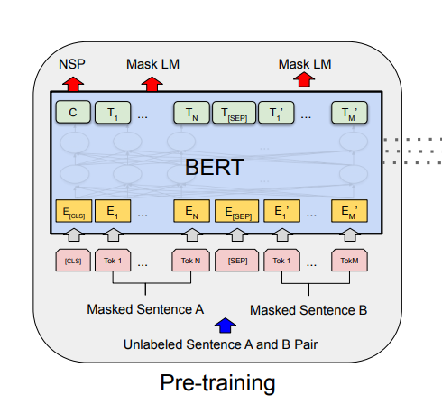
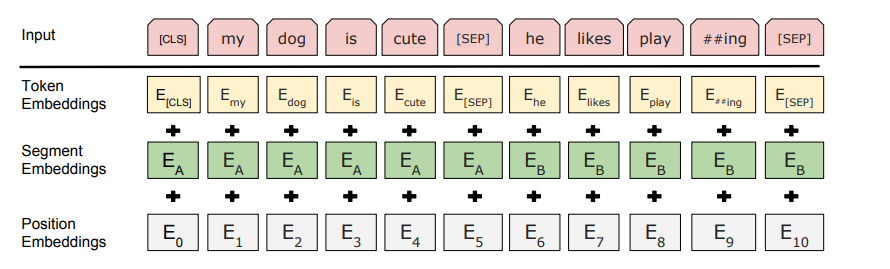
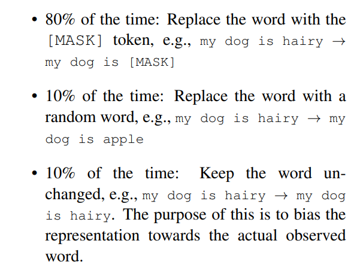
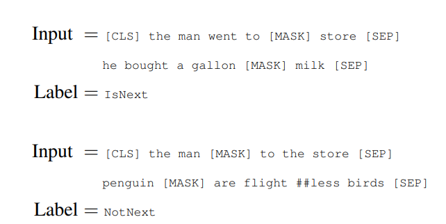

# Bert论文精读
## 标题重点
* Pre-training:training之前的任务，现在一个大的数据集上对数据进行pre-training，然后再在其他下游任务方面，进行train。
* 深度双向的Transformer
* 针对的任务为语言理解(Language Understanding):这里和Transformer不一样，Transformer那篇论文主要针对的是翻译任务。
## 摘要
* Bert is short for Bidirectional Encoder Representations from Transformer。
* Bert model：针对其他任务(例如QA)create一个精进的模型，就不需要大范围的改动模型架构，只需要finetune预训练好的Bert模型(加入一个额外的output layer)
* Bert与GPT区别：GPT是单向的，使用左边的上下文信息去预测未来，bert使用了右侧以及左侧的信息(bidirectional)
* Bert与ELMo区别：ELMo基于RNN架构，而Bert基于Transformer架构。因此ELMo用于下游任务时，需要对架构进行调整，而Bert相对简单，只需要改变最上层。
## Introduction
* NLP任务分为两类：
  * Sentence-level:分析句子之间的关系，识别句子情感
  * token-level:例如QA
* 将Pre-trained model应用于下游任务的方法主要有两种：
  * featured-based：将pre-trained representation作为额外的特征和原本数据一起输入到模型中，例如ELMo
  * fine-tuneing:训练好的参数会被进行微调
* 以上两种方法在预训练和训练中都使用的是同一个目标函数，并且都是单向的语言模型。
* 从左到右具有局限性，例如句子层面分析从左至右和从右至左都是合法的，token层面的QA任务也是这样。
* mask languange model，随机掩盖部分token，类似完型填空，可以看左和右的信息。
* next sentence prediction:随机采样了两个句子，判断两个句子是否是相连的。

## Bert实现细节
### 总述
* 预训练:在unlabeled数据上进行预训练
* 微调：首先用预训练得到的权重对模型参数进行初始化，然后再使用labeled下游任务数据对模型进行训练。
### 参数个数推导(参数个数推导有助于巩固理解step1中的Transformer模型架构)
* 模型的复杂程度和Transformer的个数呈线性关系，和H的个数呈平方关系(很好理解)
* L =12(Transformer块数)，H(hidden size) = 768,A(self-attention heads) = 12
* 嵌入层参数:字典大小* H = 30k *768
* Transformer块：
  * 自注意力机制本身没有可以学习的内容，但是多头注意力需要对K，V，Q作投影(这也应证了“Attention is all you need”这篇论文中提到的多头注意力的优点是可以使模型学习匹配不同的模式):参数WK,WV,WQ,WO都是H *H
  * MLP部分:有两个全连接层
    * 第一个输入大小为H，输出大小为4*H
    * 第二个输入大小为4*H，输出大小为H。
    * 每个矩阵大小为4H*H
    * 参数个数为2* 4H *H
* 总参数个数=30k*H +L * H * H *(8+ 4) = 107974656 ≈ 110M

### BERT模型预训练和微调同样的部分
下游模型有的是处理一个句子(注意：这里不一定是真正意义上的句子)。有的模型是处理一个句子对，例如Transformer编码器和解码器都有序列输入。因此Bert模型还需要能够将两个序列进行拼接。

* WordPeice embeddings:如果按照空格切词，词典大小会非常大。核心思想是，将不常出现的词进行切成常见的若个干个片段，词典大小就为30k
* 两个句子拼接方法:
  * 序列第一个词都是[CLS](classification)，作用是这个词的最后的输出是在classification task中代表整个句子层面的信息。这个词可以放在第一位的原因是：Bert是encoder-only架构，自注意力层没有mask机制，第一个词也可以看到其之后的所有token。
  * 两个合并到一起的句子需要能够区分
    * 方法一：用特殊token划分[SEP]
    * 方法二：对每个token学习一个嵌入层，用于标志其属于第一个句子，还是第二个句子
* 上面的内容可以用下图概括

其中每一个input的token的向量表示是token本身的Embedding+所在句子的Embedding+position Embedding(Bert中这里position Embedding是学习得到的，而Transformer中是手动构造的)，如下图所示。

### 预训练
关键部分：目标函数，预训练数据
#### Task1：Mask LLM
* 经过WordPiece划分生成词元之后，15%的token(除两个特殊token)会被替换成[MASK]用来作预测。缺点:预训练的数据和微调的数据不匹配，因为[MASK]不会在fine-tune中出现。采用下面的方案缓解这个问题:
* 这15%的词被选中之后，80%概率替换成[MASK]，10%替换成随机token，10%概率不做任何操作

#### Task2：NSP(Next Sentence Prediction)
* 许多下游任务(QA)都需要理解两个句子之间的信息。
* 选两个句子A,B。B50%概率是A之后的句子，50%随机选取。

#### 预训练数据来源
BookCorpus
English Wikipedia
#### 微调
**GLUE**:句子层面任务
* 使用CLS词元最后的向量，学习输出层W，使用softmax，得到一个多分类问题。

**QA**:
学两个向量S,E，分别对应每个词元是答案开始的概率和结束的概率。

