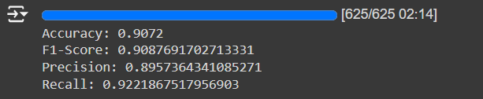

**参考**：https://huggingface.co/docs/transformers/training

### 数据准备
```python
from datasets import load_dataset
ds = load_dataset("stanfordnlp/imdb")
```

### 文本处理
* 首先需要使用模型对应的tokenizer处理文本
* 为了使得一个batched inputs(不等长的)转换成fixed-size tensors:需要Padding and trunction strategy(参考https://huggingface.co/docs/transformers/pad_truncation)
  * Padding:在较短的序列后面加特殊的padding token
  * Truncation: truncating长序列。
* tokenizer函数中的padding参数设置说明:
  * 等于True或者'longest':那么所有的序列会被pad处理到一个batch中的最长的序列。一个batch中只有一个序列，不会进行padding。
  * 等于'maxlength':如果参数中提供了max_length，那么会被pad至max_length;如果没有被提供，则会被pad至模型能够接受的最大长度。一个batch中只有一个序列，会进行padding。
  * False或者'do_not_pad':不提供padding，并且这是参数默认的值。
* tokenizer函数中truncation参数说明:
  * True/'longest_first'
  * 'only_second'
  * 'only_first'
  * False or 'do_not_truncate'
```python
from transformers import AutoTokenizer
tokenizer = AutoTokenizer.from_pretrained("google-bert/bert-base-cased")

def tokenize_function(examples):
    return tokenizer(examples["text"],padding = "max_length",truncation = True)

tokenized_datasets = ds.map(tokenize_function,batched = True)
```

### 设置评价函数
* 使用准确率accuracy，precision，recall，f1进行评估
```python
from sklearn.metrics import accuracy,precision_recall_fscore_support

def compute_metrics(pred):
    preds,labels = pred.label_ids
    preds = pred.predictions.argmax(-1)
    precision,recall,f1,_ = precision_recall_fscore_support(labels,preds,average = 'binary')
    acc = accuracy_score(labels,preds)
    return {
        'accuracy':acc,
        'f1':f1,
        'precision':precision,
        'recall':recall
    }
```

### 训练
#### 导入预训练好的模型
* IMDB数据集的label一共由两种
```python
from transformers import AutoModelForSequenceClassification
model = AutoModelForSequenceClassification.from_pretrained("google-bert/bert-base-cased",num_labels = 2)
```
#### Training hyperparameters
* 创建TrainingArguments，参考https://huggingface.co/docs/transformers/v4.44.2/en/main_classes/trainer#transformers.TrainingArguments
* num_train_epochs(float, optional, defaults to 3.0) — Total number of training epochs to perform (if not an integer, will perform the decimal part percents of the last epoch before stopping training).
* learning_rate (float, optional, defaults to 5e-5) — The initial learning rate for AdamW optimizer.
* eval_strategy (str or IntervalStrategy, optional, defaults to "no") — The evaluation strategy to adopt during training. Possible values are:
  * "no": No evaluation is done during training.
  * "steps": Evaluation is done (and logged) every eval_steps.
  * "epoch": Evaluation is done at the end of each epoch.
```python
from transformers import TrainingArguments, Trainer
training_args = TrainingArguments(
    output_dir = 'result',
    eval_strategy = "epoch",
    num_train_epochs = 3,
    learning_rate = 5e-5,
    weight_decay = 0.01,
)
```
#### 取前5000个测试集和前5000个训练集
```python
small_train_dataset = tokenized_datasets["train"].shuffle(seed=42).select(range(5000))
small_eval_dataset = tokenized_datasets["test"].shuffle(seed=42).select(range(5000))
```
#### create Trainer
```python
trainer = Trainer(
    model=model,
    args=training_args,
    train_dataset=small_train_dataset,
    eval_dataset=small_eval_dataset,
    compute_metrics=compute_metrics,
)
```
#### fine-tune前
```python
results = trainer.evaluate()
print(f"Accuracy: {results['eval_accuracy']}")
print(f"F1-Score: {results['eval_f1']}")
print(f"Precision: {results['eval_precision']}")
print(f"Recall: {results['eval_recall']}")
```
#### 模型fine-tune
```python
trainer.train()
```
#### fine-tune后的
```python
results = trainer.evaluate()
print(f"Accuracy: {results['eval_accuracy']}")
print(f"F1-Score: {results['eval_f1']}")
print(f"Precision: {results['eval_precision']}")
print(f"Recall: {results['eval_recall']}")
```
#### 说明
模型的fine_tune使用google colab实现。
#### 结果
* 进行fine_tune之前，模型的效果如下所示。

* 训练过程截图

* 训练之后模型的效果

### GPT-2
* 使用和以上步骤类似的方式可以实现在GPT-2上的微调
* 唯一的注意事项是GPT-2中的tokenizer没有pad_token，需要换成eos_token。
* 由于google colab上GPU资源有限，我只是用了1000个训练集和1000个测试集。
